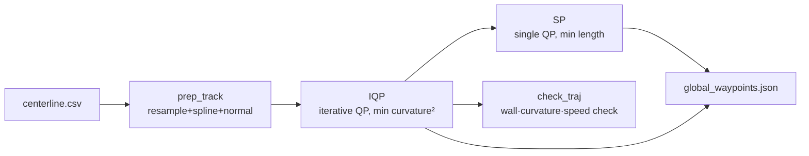

Takes `centerline.csv` and produces the **global line** the car actually drives, saving it as `global_waypoints.json`. The `trajectory_optimizer` in the `planner` package — the step after [Map Image → Centerline]({{ site.baseurl }}/posts/centerline-extraction-en/).

## ① Principle

The centerline is just the line down the middle of the track, not the **fast line**. We build two global lines.

- **IQP (minimum curvature — main)**: minimizes curvature → wide, smooth corners, usually the minimum lap time. **The line we follow.**

- **SP (shortest path — auxiliary)**: minimizes distance → a line that hugs the inner wall, used as a reference for overtaking/defending.


### Key — alpha Parameterization

The global line is expressed as **centerline + normal displacement** $\alpha$ → a 1-D variable, and "stay inside the walls" becomes a simple box constraint.

$$
\mathbf{p}_{race}(s) = \mathbf{p}_{center}(s) + \alpha(s)\,\mathbf{n}(s), \qquad -w_{r} \le \alpha \le w_{l}
$$


### Pipeline



**IQP** — curvature is nonlinear in $\alpha$, so each iteration linearizes it and solves a QP (= Iterative QP); **SP** — length is smooth, so a single QP.

$$
\min_\alpha \sum_i \kappa_i(\alpha)^2 \qquad\qquad \min_\alpha \sum_i \lVert p_{i+1}-p_i\rVert^2
$$


### Check Trajectory (Safety Validation)

Checks for wall collision (ERROR), insufficient margin (WARN), curvature limit, speed limit, and lateral acceleration ( $v_x^2|\kappa|$ ) limit.


## ② Running It (RoboStack)

```bash
source unicorn.sh
cbuild
# optimize the global line on a map that has centerline.csv
ros2 run planner trajectory_optimizer --ros-args -p map_name:=f
# → maps/f/global_waypoints.json (IQP main) + shortest_path.json (SP)
```

For tuning, edit `racecar.ini` (vehicle/optimization values) directly rather than ROS parameters. Key ones: `v_max`, `curvlim`, `optim_opts_mincurv.width_opt` (IQP safety width), `optim_opts_shortest_path.width_opt` (SP).

## ③ Results

Live run on map `f` in a RoboStack env:

```
[TrajectoryOptimizer] loading: maps/f/centerline.csv
[TrajectoryOptimizer] optimizing on 1680 centerline points (margin=0.2, v_max=6.0, a_lat=6.0, a_long=4.0)
[TrajectoryOptimizer] saved 345 pts -> maps/f/global_waypoints.csv (v_min=2.85, v_max=6.00 m/s, |kappa|max=0.740)
```

**IQP global raceline (speed-colored)** — straights in red (6 m/s), corners in blue (≈2.85 m/s). You can see the minimum-curvature line cutting wide into the corners:


**Speed profile** vx(s) — decelerate in corners, accelerate on straights:


> 1680 centerline points → IQP optimization → 345-point global raceline + speed profile. This `global_waypoints` is followed by [Pure Pursuit]({{ site.baseurl }}/posts/pure-pursuit-en/).
{: .prompt-tip }

## Wrap-up

Taking `centerline.csv`, it builds two global lines — **IQP (minimum curvature, main)** and **SP (shortest path, auxiliary)** — and saves them as `global_waypoints.json`.

- IQP minimizes curvature² for wide, smooth corners → usually minimum lap time, the line we follow
- SP minimizes distance → reference for overtaking/defending
- `check_traj` validates walls, curvature, speed, and lateral acceleration

The previous step is [Map Image → Centerline extraction]({{ site.baseurl }}/posts/centerline-extraction-en/), and the controller that follows this result is [Pure Pursuit]({{ site.baseurl }}/posts/pure-pursuit-en/). For the minimum-time line that solves the dynamics directly, see [Mintime Optimization]({{ site.baseurl }}/posts/mintime-optimization-en/).
