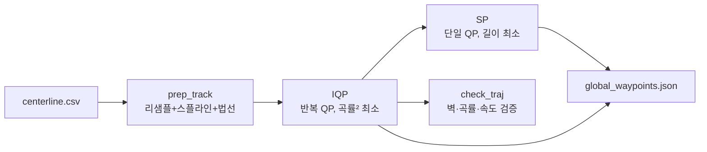

`centerline.csv`를 받아 실제로 달릴 **global line**을 만들어 `global_waypoints.json`으로 저장합니다. `planner` 패키지의 `trajectory_optimizer` — [맵 이미지 → Centerline]({{ site.baseurl }}/posts/centerline-extraction/) 다음 단계.

## ① 원리

centerline은 트랙 한가운데 선일 뿐 **빠른 선**이 아닙니다. 두 가지 global line을 만듭니다.

- **IQP (최소곡률 — 메인)**: 곡률을 최소화 → 코너를 넓고 부드럽게, 보통 최소 랩타임. **우리가 추종하는 라인.**

- **SP (최단경로 — 보조)**: 거리 최소 → 안쪽 벽에 붙는 라인, 추월·방어 참고용.


### 핵심 — alpha 파라미터화

global line을 **센터라인 + 법선 변위 ** $\alpha$ 로 표현 → 변수가 1차원, "벽 안 넘기"가 단순 박스 제약.

$$
\mathbf{p}_{race}(s) = \mathbf{p}_{center}(s) + \alpha(s)\,\mathbf{n}(s), \qquad -w_{r} \le \alpha \le w_{l}
$$


### 파이프라인



**IQP** — 곡률은 $\alpha$ 에 비선형이라 각 반복에서 선형화해 QP로 풀고(=Iterative QP), **SP** — 길이는 매끄러워 QP 한 번.

$$
\min_\alpha \sum_i \kappa_i(\alpha)^2 \qquad\qquad \min_\alpha \sum_i \lVert p_{i+1}-p_i\rVert^2
$$


### Check Trajectory (안전 검증)

벽 충돌(ERROR)·여유 부족(WARN)·곡률 초과·속도 초과·횡가속도( $v_x^2|\kappa|$ ) 초과를 검사.


## ② 실행 (RoboStack)

```bash
source unicorn.sh
cbuild
# centerline.csv가 있는 맵에서 global line 최적화
ros2 run planner trajectory_optimizer --ros-args -p map_name:=f
# → maps/f/global_waypoints.json (IQP 메인) + shortest_path.json (SP)
```

튜닝은 ROS 파라미터보다 `racecar.ini`(차량·최적화 값)를 직접 수정. 주요: `v_max`, `curvlim`, `optim_opts_mincurv.width_opt`(IQP 안전폭), `optim_opts_shortest_path.width_opt`(SP).

## ③ 실행 결과

RoboStack env에서 map `f` **라이브 실행** 결과:

```
[TrajectoryOptimizer] loading: maps/f/centerline.csv
[TrajectoryOptimizer] optimizing on 1680 centerline points (margin=0.2, v_max=6.0, a_lat=6.0, a_long=4.0)
[TrajectoryOptimizer] saved 345 pts -> maps/f/global_waypoints.csv (v_min=2.85, v_max=6.00 m/s, |kappa|max=0.740)
```

**IQP global raceline (속도 컬러)** — 직선은 빨강(6 m/s), 코너는 파랑(≈2.85 m/s). 코너를 넓게 깎아 들어가는 최소곡률 라인이 보입니다:


**속도 프로파일** vx(s) — 코너에서 감속, 직선에서 가속:


> centerline 1680점 → IQP 최적화 → 345점 global raceline + 속도 프로파일. 이 `global_waypoints`를 [Pure Pursuit]({{ site.baseurl }}/posts/pure-pursuit/)가 추종합니다.
{: .prompt-tip }

## 마무리

`centerline.csv`를 받아 **IQP(최소곡률, 메인)**와 **SP(최단경로, 보조)** 두 global line을 만들어 `global_waypoints.json`으로 저장합니다.

- IQP는 곡률²을 최소화해 코너를 넓고 부드럽게 → 보통 최소 랩타임, 추종 대상 라인
- SP는 거리를 최소화 → 추월·방어 참고용
- `check_traj`로 벽·곡률·속도·횡가속도를 검증

앞 단계는 [맵 이미지 → Centerline 추출]({{ site.baseurl }}/posts/centerline-extraction/), 이 결과를 추종하는 제어는 [Pure Pursuit]({{ site.baseurl }}/posts/pure-pursuit/)입니다. 동역학을 직접 푸는 최소시간 라인은 [Mintime Optimization]({{ site.baseurl }}/posts/mintime-optimization/)을 함께 참고하세요.
