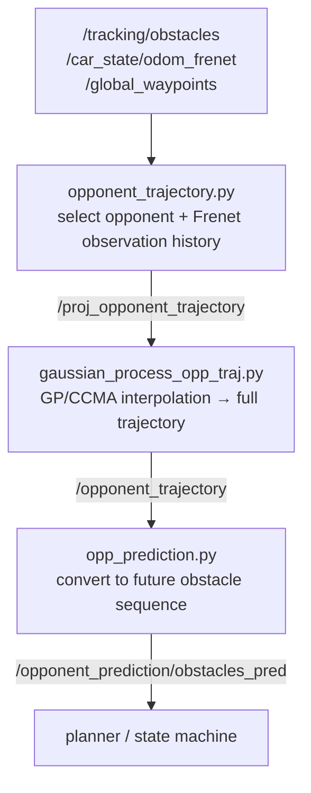

`gp_traj_predictor` learns the motion of the opponent detected by tracking to build the opponent's driving line, and produces the **future obstacle prediction** that the planner uses. The key is handling the opponent's position in **Frenet coordinates** ( $s$ = progress distance, $d$ = lateral deviation).

## ① Principle

After collecting opponent observations as $(s, d, v_s, v_d)$, **Gaussian Process Regression** estimates the line and speed as a function of $s$. The GP gives not only the mean but also the **uncertainty** (`d_var`, `vs_var`), partly visualized via RViz marker size/color.

$$
d = f(s) + \epsilon
$$



| File | Role |
|---|---|
| `opponent_trajectory.py` | select opponent from tracking + Frenet observation history |
| `gaussian_process_opp_traj.py` | interpolate observations with GP/CCMA into a full trajectory |
| `predictor_opponent_trajectory.py` | auxiliary return-trajectory prediction when the opponent leaves the line |
| `opp_prediction.py` | learned trajectory → future obstacle sequence for the planner |

### Key Steps

- **Observation collection** — from `/tracking/obstacles`, pick the closest opponent relative to ego and organize a Frenet $(s,d,v_s,v_d)$ history.

- **GP trajectory generation** — estimate $s\to d$ and $s\to v_s$ with a GP. Initially only the observed half-lap segment; once more than a lap accumulates, the whole lap. The discontinuity near the start line ( $s=0 \leftrightarrow s=L$ ) is handled with wrap-around by duplicating the leading/trailing segments.

- **Return-to-line prediction** — if an observation differs from the existing trajectory's $d$ by more than 0.3 m, `opp_is_on_trajectory=False` → blend the latest detection with the existing line to generate a return trajectory (it does not assume infinite straight-line motion).

## ② Running It (RoboStack)

Prediction is launched as part of the **full stack** where perception (detect/tracking) and localization run together (`perception` package · `opponent_predictor`).

```bash
unicorn                    # conda env + CycloneDDS + workspace
cbuild
# full autonomy with a virtual opponent (prediction included)
ros2 launch stack_master headtohead.launch.xml sim:=true map:=f
# prediction alone: ros2 run perception opponent_predictor
```

- Inputs: `/tracking/obstacles`, `/car_state/odom_frenet`, `/global_waypoints`

- Outputs: `/opponent_trajectory`, `/opponent_prediction/obstacles_pred`, `/opponent_prediction/force_trailing`

> Stack position: perception → tracking → **prediction** → planning → state machine → control

## ③ Results

**Half-lap observation stage** — only the observed segment is updated by the GP:


**Whole-lap trajectory** — once more than a lap of observations accumulates, the opponent's repeated driving line is generated:


> The mean + uncertainty from the GP becomes the basis for the planner's avoidance/overtaking decisions.
{: .prompt-info }

## Wrap-up

`gp_traj_predictor` interpolates the opponent observations from tracking in Frenet coordinates with a **Gaussian Process**, estimating the opponent's repeated driving line and its uncertainty, and produces the future obstacle sequence the planner uses.

- Observation collection (Frenet) → GP estimates of $s\to d$, $s\to v_s$ → future obstacle prediction
- Provides not just the mean but also the uncertainty, informing avoidance/overtaking decisions

The `/global_waypoints` the GP uses as its reference frame is generated by [Global Trajectory Optimization]({{ site.baseurl }}/posts/global-trajectory-optimization-en/).
