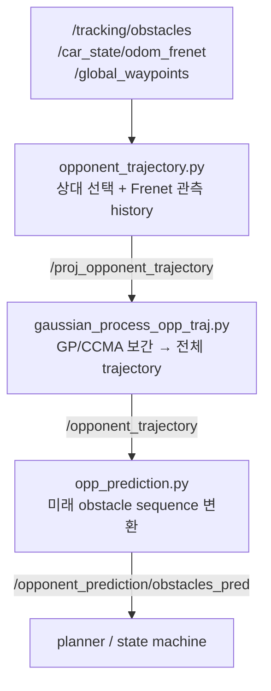

`gp_traj_predictor`는 tracking이 검출한 상대 차량의 움직임을 학습해 상대의 주행 라인을 만들고, planner가 쓸 **미래 obstacle prediction**을 생성합니다. 핵심은 상대 위치를 **Frenet 좌표**( $s$ =진행거리, $d$ =횡방향 편차)로 다루는 것.

## ① 원리

상대 관측을 $(s, d, v_s, v_d)$ 로 모은 뒤, **Gaussian Process Regression**으로 $s$ 에 따른 라인과 속도를 추정합니다. GP는 평균뿐 아니라 **불확실성**도 주며(`d_var`, `vs_var`), RViz 마커 크기·색으로 일부 시각화됩니다.

$$
d = f(s) + \epsilon
$$



| 파일 | 역할 |
|---|---|
| `opponent_trajectory.py` | tracking에서 상대 선택 + Frenet 관측 history |
| `gaussian_process_opp_traj.py` | 관측을 GP/CCMA로 보간해 전체 trajectory 생성 |
| `predictor_opponent_trajectory.py` | 상대 이탈 시 복귀 궤적 보조 예측 |
| `opp_prediction.py` | 학습 trajectory → planner용 미래 obstacle sequence |

### 핵심 단계

- **관측 수집** — `/tracking/obstacles`에서 ego 기준 가장 가까운 상대를 골라 Frenet $(s,d,v_s,v_d)$ history로 정리.

- **GP trajectory 생성** — $s\to d$ , $s\to v_s$ 를 GP로 추정. 초기엔 half-lap 구간만, 한 바퀴 이상 쌓이면 whole-lap. 시작선 근처 $s=0 \leftrightarrow s=L$ 끊김은 앞뒤 구간 복제로 wrap-around 처리.

- **이탈 복귀 예측** — 관측이 기존 궤적 $d$ 와 0.3 m 이상 차이면 `opp_is_on_trajectory=False` → 최근 detection + 기존 라인을 섞어 복귀 궤적 생성(무한 직진 가정 안 함).

## ② 실행 (RoboStack)

예측은 perception(detect/tracking)·localization이 함께 돌아가는 **풀 스택**의 일부로 기동됩니다(`perception` 패키지 · `opponent_predictor`).

```bash
unicorn                    # conda env + CycloneDDS + 워크스페이스
cbuild
# 가상 상대 포함 풀 자율주행 (prediction 포함)
ros2 launch stack_master headtohead.launch.xml sim:=true map:=f
# 예측 단독: ros2 run perception opponent_predictor
```

- 입력: `/tracking/obstacles`, `/car_state/odom_frenet`, `/global_waypoints`

- 출력: `/opponent_trajectory`, `/opponent_prediction/obstacles_pred`, `/opponent_prediction/force_trailing`

> 스택 위치: perception → tracking → **prediction** → planning → state machine → control

## ③ 실행 결과

**half-lap 관측 단계** — 관측된 구간만 GP로 업데이트:


**whole-lap trajectory** — 한 바퀴 이상 관측이 쌓이면 상대의 반복 주행 라인 생성:


> GP가 주는 평균+불확실성이 planner의 회피/추월 판단 근거가 됩니다.
{: .prompt-info }

## 마무리

`gp_traj_predictor`는 tracking이 준 상대 관측을 Frenet 좌표에서 **Gaussian Process**로 보간해, 상대의 반복 주행 라인과 불확실성을 추정하고 planner가 쓸 미래 obstacle 시퀀스를 만듭니다.

- 관측 수집(Frenet) → GP로 $s\to d$, $s\to v_s$ 추정 → 미래 obstacle prediction
- 평균뿐 아니라 불확실성도 제공해 회피·추월 판단의 근거가 됩니다

GP가 기준 좌표로 삼는 `/global_waypoints`는 [Global Trajectory Optimization]({{ site.baseurl }}/posts/global-trajectory-optimization/)에서 생성됩니다.
