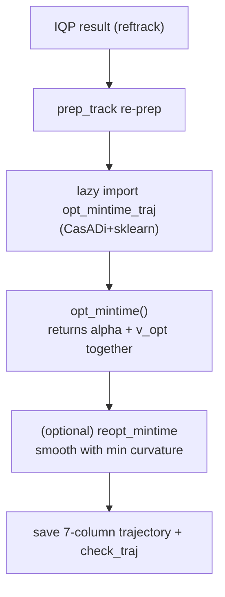

An optional optimization that finds the **theoretically fastest line** by solving the vehicle dynamics and tire model directly. TUM `gb_optimizer`'s `trajectory_optimizer(curv_opt_type='mintime')`.

## ① Principle

Whereas IQP/SP approximate a "geometrically good line," mintime puts the **lap time itself as the objective** and simultaneously finds a line + speed that satisfy the dynamics.


|  | IQP | SP | mintime |
|---|---|---|---|
| Variables | alpha | alpha | alpha + speed + vehicle state |
| Objective | min curvature² | min distance | **min lap time** |
| Model | geometric | geometric | **dynamics + tire + actuator** |
| Solver | iterative QP | single QP | nonlinear OCP (CasADi/IPOPT) |
| Speed | post-computed | post-computed | **built into the optimization** |
| Cost | moderate | fast | **slow (tens of sec ~ min)** |

### Minimum-Time OCP

With the track position $s$ as the independent variable and the vehicle state/speed at each point as unknowns, minimize the traversal time:

$$
\min_{\mathbf{u}}\ T = \int_0^{s_{end}} \frac{1}{\dot s}\,ds \quad\text{s.t.}\quad \dot{\mathbf{x}}=f(\mathbf{x},\mathbf{u}),\ \mathbf{g}(\mathbf{x},\mathbf{u})\le 0
$$

Tire forces use the **Magic Formula (Pacejka)**, constrained not to exceed the combined longitudinal/lateral grip limit (the friction circle). There is no closed-form solution, so it is solved numerically with CasADi discretization + IPOPT.

### Code Flow — `_run_mintime()`



- **lazy import**: CasADi/sklearn are imported inside the function only for mintime → not loaded if unused

- **OCP returns `v_opt` too** — the speed comes out of the optimization, not a post-computation (the decisive difference from IQP/SP)

- **reopt_mintime_solution**: a post-process that smooths the OCP line once more with minimum curvature if it is rough

#### Parameters (racecar_f110.ini)

| Section | Example keys | Meaning |
|---|---|---|
| `optim_opts_mintime` | width_opt, penalty_delta, mue | optimization behavior / friction coefficient |
| `vehicle_params_mintime` | I_z, cog_z, f_drive_max | dynamics properties |
| `tire_params_mintime` | B/C/E, f_z0 | Pacejka coefficients |

## ② Running It

mintime is **not exposed as a runtime node.** `global_planner_node` calls only IQP (`mincurv_iqp`) and SP (`shortest_path`); mintime is an **offline path that calls the TUM library directly**.

```python
from global_racetrajectory_optimization.trajectory_optimizer import trajectory_optimizer
traj, *_ = trajectory_optimizer(input_path=<inputs>, track_name='f',
                                curv_opt_type='mintime', safety_width=0.30)
# required deps : casadi, ipopt, sklearn, quadprog, trajectory_planning_helpers
# required config : vehicle_params_mintime / tire_params_mintime in racecar_f110.ini
```

> mintime is expensive (CasADi/IPOPT-based) and is only meaningful when the vehicle/tire parameters match the real car. It is off by default, and the production global line is IQP/SP.
{: .prompt-warning }

## ③ Results

> The **production global line in this stack is IQP/SP**, and mintime is an optional, offline feature. In the current RoboStack env (pinned to **numpy 2.x** for ROS), TUM mintime (`opt_mintime_traj`, `trajectory_planning_helpers` 0.79) is **blocked from a live run due to legacy dependency incompatibility** — a tph/scipy↔numpy2 conflict (spline approximation failure + inhomogeneous array in `opt_mintime`). Actually running it requires separate work: porting TUM `opt_mintime` to numpy2 + re-tuning the splines for the F1TENTH scale.
{: .prompt-info }

Instead, for an **actual live optimization result**, see the IQP raceline on the same track (map `f`) — the Results section (③) of [Global Trajectory Optimization]({{ site.baseurl }}/posts/global-trajectory-optimization-en/) (speed-colored raceline + speed profile, 1680 centerline points → 345 points).

## Wrap-up

mintime is a nonlinear OCP (CasADi/IPOPT) that **minimizes the lap time itself** by solving the vehicle dynamics and tire model directly. By including speed among the optimization variables, it yields the theoretically fastest line — but it is costly and only meaningful when the vehicle/tire parameters precisely match the real car.

The default production global line is the IQP/SP of [Global Trajectory Optimization]({{ site.baseurl }}/posts/global-trajectory-optimization-en/); mintime is an optional, offline alternative.
