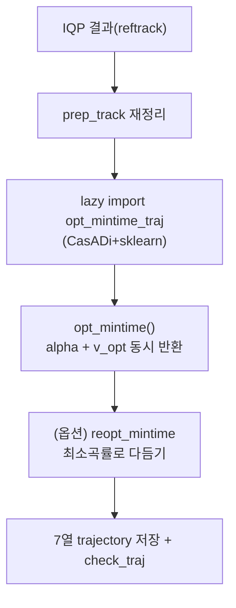

차량 동역학과 타이어 모델을 직접 풀어 **이론상 가장 빠른 라인**을 찾는 선택적 최적화. TUM `gb_optimizer`의 `trajectory_optimizer(curv_opt_type='mintime')`.

## ① 원리

IQP/SP가 "기하학적으로 좋은 라인"을 근사하는 데 비해, mintime은 **랩타임 자체를 목적함수**로 두고 동역학을 만족하는 라인+속도를 동시에 찾습니다.


|  | IQP | SP | mintime |
|---|---|---|---|
| 변수 | alpha | alpha | alpha + 속도 + 차량상태 |
| 목적 | 곡률² 최소 | 거리 최소 | **랩타임 최소** |
| 모델 | 기하 | 기하 | **동역학+타이어+액추에이터** |
| 풀이 | 반복 QP | 단일 QP | 비선형 OCP (CasADi/IPOPT) |
| 속도 | 사후계산 | 사후계산 | **최적화에 내장** |
| 비용 | 보통 | 빠름 | **느림 (수십초~분)** |

### 시간 최소화 OCP

트랙 위치 $s$ 를 독립변수로, 각 지점의 차량 상태·속도를 미지수로 두고 통과 시간을 최소화:

$$
\min_{\mathbf{u}}\ T = \int_0^{s_{end}} \frac{1}{\dot s}\,ds \quad\text{s.t.}\quad \dot{\mathbf{x}}=f(\mathbf{x},\mathbf{u}),\ \mathbf{g}(\mathbf{x},\mathbf{u})\le 0
$$

타이어 힘은 **Magic Formula(Pacejka)** 로, 종/횡 그립 결합 한계(마찰원)를 넘지 않게 제약. 닫힌 해가 없어 CasADi 이산화 + IPOPT로 수치해.

### 코드 흐름 — `_run_mintime()`



- **lazy import**: CasADi/sklearn은 mintime에서만 함수 내 import → 안 쓰면 로드 안 됨

- **OCP가 `v_opt`까지 반환** — 속도가 사후계산이 아니라 최적화 안에서 나옴 (IQP/SP와 결정적 차이)

- **reopt_mintime_solution**: OCP 라인이 거칠면 최소곡률로 한 번 더 다듬는 후처리

#### 파라미터 (racecar_f110.ini)

| 섹션 | 키 예 | 의미 |
|---|---|---|
| `optim_opts_mintime` | width_opt, penalty_delta, mue | 최적화 동작·마찰계수 |
| `vehicle_params_mintime` | I_z, cog_z, f_drive_max | 동역학 물성 |
| `tire_params_mintime` | B/C/E, f_z0 | Pacejka 계수 |

## ② 실행

mintime은 **런타임 노드로 노출돼 있지 않습니다.** `global_planner_node`는 IQP(`mincurv_iqp`)와 SP(`shortest_path`)만 호출하고, mintime은 TUM 라이브러리를 **직접 호출하는 오프라인 경로**입니다.

```python
from global_racetrajectory_optimization.trajectory_optimizer import trajectory_optimizer
traj, *_ = trajectory_optimizer(input_path=<inputs>, track_name='f',
                                curv_opt_type='mintime', safety_width=0.30)
# 필요 deps : casadi, ipopt, sklearn, quadprog, trajectory_planning_helpers
# 필요 설정 : racecar_f110.ini의 vehicle_params_mintime / tire_params_mintime
```

> mintime은 CasADi/IPOPT 기반 고비용이고, 차량·타이어 파라미터가 실차와 맞아야 의미가 있습니다. 기본은 꺼져 있으며 production 글로벌 라인은 IQP/SP입니다.
{: .prompt-warning }

## ③ 실행 결과

> 이 스택의 **production 글로벌 라인은 IQP/SP**이고, mintime은 선택적·오프라인 기능입니다. 현재 RoboStack env(ROS용 **numpy 2.x** 고정)에서 TUM mintime(`opt_mintime_traj`, `trajectory_planning_helpers` 0.79)은 **레거시 의존성 비호환**으로 라이브 실행이 막혔습니다 — tph/scipy↔numpy2 충돌(spline 근사 실패 + `opt_mintime`의 inhomogeneous array). 실제로 돌리려면 TUM `opt_mintime`을 numpy2로 포팅 + F1TENTH 스케일 스플라인 재튜닝이라는 별도 작업이 필요합니다.
{: .prompt-info }

대신 **실제 라이브 최적화 결과**는 같은 트랙(map `f`)의 IQP raceline을 참고하세요 — [Global Trajectory Optimization]({{ site.baseurl }}/posts/global-trajectory-optimization/)의 ③ 실행 결과(속도 컬러 raceline + 속도 프로파일, centerline 1680점 → 345점).

## 마무리

mintime은 차량 동역학·타이어 모델을 직접 풀어 **랩타임 자체를 최소화**하는 비선형 OCP(CasADi/IPOPT)입니다. 속도까지 최적화 변수에 포함해 이론상 가장 빠른 라인을 주지만, 비용이 크고 차량·타이어 파라미터가 실차와 정확히 맞아야 의미가 있습니다.

production 기본 글로벌 라인은 [Global Trajectory Optimization]({{ site.baseurl }}/posts/global-trajectory-optimization/)의 IQP/SP이며, mintime은 선택적·오프라인 옵션입니다.
