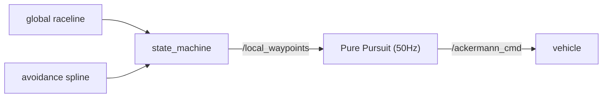

The **runtime tracking controller** that turns the raceline from global planning into actual steering/speed commands. With geometric Pure Pursuit as the skeleton, it stacks adaptive lookahead, understeer, heading PID, and friction-circle speed control on top to hold the line even at high speed. (`controller` package · `pp_node`)

> Stack position: perception → tracking → prediction → planning → state machine → **control (Pure Pursuit)**

## ① Principle

The tracker is **agnostic to where the path comes from** — it follows the global raceline normally, and an avoidance spline when there is an obstacle, in exactly the same way.



### Core: Geometric Pure Pursuit

Pick a target point a fixed distance ahead ( $l_d$ ) on the path, and compute the steering angle that traces an arc through that point.

$$
\kappa_{pp} = \frac{2\, l_y}{l_d^{2}}, \qquad \delta_{geo} = \arctan(L\cdot \kappa_{pp})
$$


### Extension Modules

**Module 1 — Adaptive Lookahead**: a fixed lookahead can't satisfy low and high speed at once → make it proportional to speed (time-headway).

$$
l_d = \mathrm{clip}(t_{hw}\cdot v_x,\ l_{d,\min},\ l_{d,\max})
$$


| Parameter | Value | Meaning |
|---|---|---|
| `t_headway` | 0.3 s | how far ahead (in time) to look |
| `ld_min` / `ld_max` | 0.6 / 2.5 m | lookahead lower/upper bound |

**Module 2 — Understeer Feedforward**: pre-compensate for high-speed corner understeer. $\delta_{us}=k_{us}\,a_{lat}$ ( `k_understeer`=0.010 ).


**Module 3 — Residual Heading PID**: PID-correct only the heading error $e_h$ that pure pursuit leaves behind ( `Kp/Ki/Kd`=0.4/0/0.05 ).


**Module 4 — Friction-Circle Speed/Accel Control**: distribute the total grip $a_{total}$ into lateral/longitudinal + predictive braking + a heading-aligned acceleration gate.

$$
a_{long} = \min(a_{long,\max},\ \sqrt{a_{total,\max}^2 - a_{lat,ref}^2})
$$

> The friction circle appears in both global planning (offline, shaping the line via the ggv) and Pure Pursuit (runtime, clamped every 50Hz) — the timing and target differ. The controller's friction circle is a real-time safeguard regardless of the current path.
{: .prompt-info }

## ② Running It (RoboStack)

> Runs in the RoboStack conda env (`unicorn`) with no system ROS. Same setup procedure as the Centerline page.
{: .prompt-tip }

```bash
unicorn                    # = source unicorn.sh (conda env + CycloneDDS + workspace)
cbuild                     # colcon build + re-source
# full autonomy (perception → tracking → prediction → planning → state machine → control) + virtual opponent
ros2 launch stack_master headtohead.launch.xml sim:=true map:=f
# Pure Pursuit alone: ros2 run controller pp_node   (or stack_master/ppc.launch.xml)
```

- Package/node: `controller` · `pp_node`

- Subscribes: `/car_state/odom`, `/local_waypoints` (output of state_machine)

- Publishes: `/vesc/high_level/ackermann_cmd` (steering + speed), `/pp/lookahead` (RViz)

## ③ Results

The actual screen of Pure Pursuit following the raceline in simulation:

<video controls width="100%">
  <source src="{{ site.baseurl }}/assets/img/posts/pure-pursuit/pp-sim.mp4" type="video/mp4">
</video>

> Whatever the path (global raceline or avoidance spline), it is handled as the same tracking problem — fast driving and safe detours with one controller.
{: .prompt-info }

## Wrap-up

Pure Pursuit is a geometric controller that produces steering as an arc toward a look-ahead target on the raceline; on top of it, four modules — **adaptive lookahead · understeer FF · residual heading PID · friction-circle speed control** — keep the line stable even at high speed.

- Handles any path source (global raceline / avoidance spline) as the same tracking problem
- The friction circle clamps speed/accel in real time every 50Hz for safety

The global raceline it follows is produced by [Global Trajectory Optimization]({{ site.baseurl }}/posts/global-trajectory-optimization-en/), and the predictions behind opponent avoidance come from [Gaussian Process trajectory prediction]({{ site.baseurl }}/posts/gp-opponent-prediction-en/).
