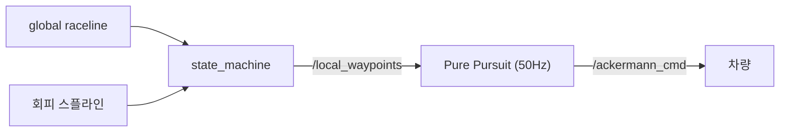

Global planning이 만든 raceline을 실제 조향·속도 명령으로 바꾸는 **런타임 추종 제어기**. 기하학적 Pure Pursuit을 뼈대로, 그 위에 적응형 lookahead·understeer·헤딩 PID·마찰원 속도제어를 올려 고속에서도 라인을 붙입니다. (`controller` 패키지 · `pp_node`)

> 스택 위치: perception → tracking → prediction → planning → state machine → **control(Pure Pursuit)**

## ① 원리

추종기는 **경로의 출처를 가리지 않습니다** — 평상시 global raceline, 장애물 시 회피 스플라인이 들어와도 동일하게 추종합니다.



### 메인: 기하학적 Pure Pursuit

경로 위 전방 일정 거리( $l_d$ )의 목표점을 잡고, 그 점을 지나는 원호를 그리는 조향각을 계산합니다.

$$
\kappa_{pp} = \frac{2\, l_y}{l_d^{2}}, \qquad \delta_{geo} = \arctan(L\cdot \kappa_{pp})
$$


### 확장 모듈

**모듈 1 — Adaptive Lookahead**: 고정 lookahead는 저속·고속을 동시 만족 못함 → 속도에 비례(time-headway).

$$
l_d = \mathrm{clip}(t_{hw}\cdot v_x,\ l_{d,\min},\ l_{d,\max})
$$


| 파라미터 | 값 | 의미 |
|---|---|---|
| `t_headway` | 0.3 s | 앞을 보는 시간 |
| `ld_min` / `ld_max` | 0.6 / 2.5 m | lookahead 하한/상한 |

**모듈 2 — Understeer Feedforward**: 고속 코너 언더스티어를 미리 보정. $\delta_{us}=k_{us}\,a_{lat}$ ( `k_understeer`=0.010 ).


**모듈 3 — 잔차 헤딩 PID**: 순수추종이 남긴 헤딩 오차 $e_h$ 만 PID 보정 ( `Kp/Ki/Kd`=0.4/0/0.05 ).


**모듈 4 — 마찰원 속도·가속 제어**: 전체 그립 $a_{total}$ 을 횡/종으로 분배 + 예측 제동 + 헤딩정렬 가속 게이트.

$$
a_{long} = \min(a_{long,\max},\ \sqrt{a_{total,\max}^2 - a_{lat,ref}^2})
$$

> 마찰원은 global planning(오프라인, ggv로 라인 모양)과 Pure Pursuit(런타임, 매 50Hz 클램프) 둘 다 등장 — 시점·대상이 다릅니다. 컨트롤러의 마찰원은 현재 경로가 무엇이든 실시간 안전장치.
{: .prompt-info }

## ② 실행 (RoboStack)

> RoboStack conda env(`unicorn`)에서 시스템 ROS 없이 동작. Centerline 페이지의 구축 절차와 동일.
{: .prompt-tip }

```bash
unicorn                    # = source unicorn.sh (conda env + CycloneDDS + 워크스페이스)
cbuild                     # colcon 빌드 + 재-source
# 풀 자율주행(perception → tracking → prediction → planning → state machine → control) + 가상 상대
ros2 launch stack_master headtohead.launch.xml sim:=true map:=f
# Pure Pursuit 단독: ros2 run controller pp_node   (또는 stack_master/ppc.launch.xml)
```

- 패키지/노드: `controller` · `pp_node`

- 구독: `/car_state/odom`, `/local_waypoints`(state_machine 출력)

- 발행: `/vesc/high_level/ackermann_cmd`(조향+속도), `/pp/lookahead`(RViz)

## ③ 실행 결과

시뮬레이션에서 Pure Pursuit이 raceline을 추종하며 주행하는 실제 화면:

<video controls width="100%">
  <source src="{{ site.baseurl }}/assets/img/posts/pure-pursuit/pp-sim.mp4" type="video/mp4">
</video>

> 경로(global raceline 또는 회피 스플라인)가 무엇이든 동일한 추종 문제로 처리 — 빠른 주행과 안전한 우회를 같은 컨트롤러로.
{: .prompt-info }

## 마무리

Pure Pursuit은 raceline 위 전방 목표점을 향하는 원호로 조향을 만드는 기하 제어기이며, 여기에 **적응형 lookahead · understeer FF · 잔차 헤딩 PID · 마찰원 속도제어** 4개 모듈을 얹어 고속에서도 라인을 안정적으로 붙입니다.

- 경로의 출처(global raceline / 회피 스플라인)와 무관하게 동일한 추종 문제로 처리
- 마찰원으로 매 50Hz 실시간 속도·가속을 클램프해 안전 확보

추종 대상인 global raceline은 [Global Trajectory Optimization]({{ site.baseurl }}/posts/global-trajectory-optimization/)에서, 상대 차량 회피의 근거가 되는 예측은 [Gaussian Process 궤적 예측]({{ site.baseurl }}/posts/gp-opponent-prediction/)에서 만들어집니다.
